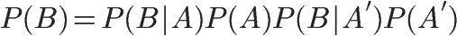
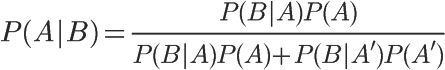
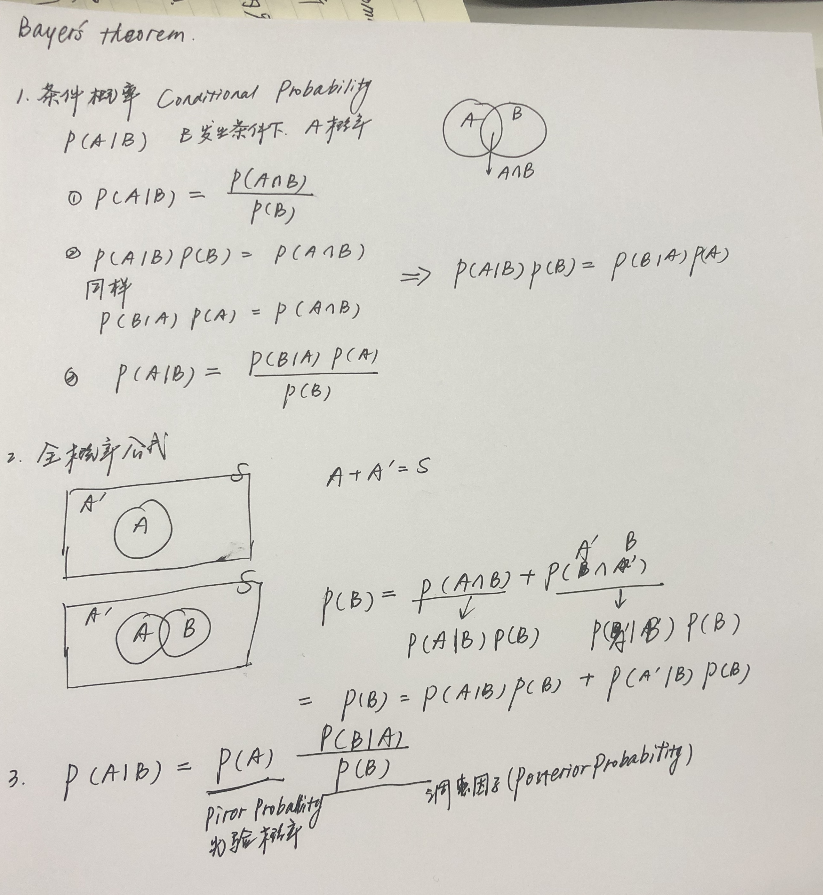
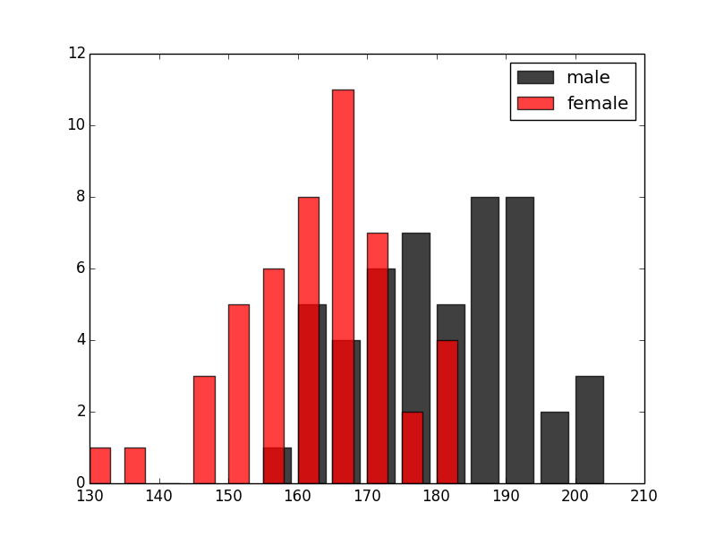

# [Bayes' Theorem]

[Reference] 
- *https://www.python-course.eu/naive_bayes_classifier_introduction.php
- https://dzone.com/articles/naive-bayes-tutorial-naive-bayes-classifier-in-pyt
- https://www.zhihu.com/question/19725590
- https://www.youtube.com/watch?v=XQoLVl31ZfQ

### 1. What Is Naive Bayes?
- **Naive Bayes** is among one of the simplest,
- but most powerful algorithms for **classification** based on [Bayes' Theorem] with an assumption of independence among predictors

### 2. 现实生活中有什么用?
- 同样的，在现实世界中，我们每个人都需要预测。想要深入分析未来、思考是否买股票、政策给自己带来哪些机遇、提出新产品构想，或者只是计划一周的饭菜。
- 贝叶斯定理就是为了解决这些问题而诞生的，它可以根据过去的数据来预测出概率。
- Spam Filtering
- Medical Diagnosis
- Weather Prediction

### 3. What Is Bayes' Theorem?
- In statistics and probability theory, Bayes' theorem describes the ***probability of an event***, based on ***prior knowledge of conditions*** that might be related to the event. It serves as a way to figure out conditional probability.

- 更好理解图
  


- 条件概率公式
- https://www.youtube.com/watch?v=ibINrxJLvlM
- P(A): prior probability
- P(B|A)/P(B): likelihood ratio
  


- 全概率公式
  


- 条件概率另一种写法
  


- 推导记录
  


<p>在这里，如果"可能性函数"P(B|A)/P(B)>1，意味着"先验概率"被增强，事件A的发生的可能性变大；如果"可能性函数"=1，意味着B事件无助于判断事件A的可能性；如果"可能性函数" 小于1, 意味着"先验概率"被削弱，事件A的可能性变小。</p>


### 4. 例子
- 水果糖问题 http://www.ruanyifeng.com/blog/2011/08/bayesian_inference_part_one.html
- spam http://www.ruanyifeng.com/blog/2011/08/bayesian_inference_part_two.html

### 5. Naive Bayes Classifier
[Reference]
- https://www.python-course.eu/naive_bayes_classifier_introduction.php
- https://zh.wikipedia.org/wiki/%E6%9C%B4%E7%B4%A0%E8%B4%9D%E5%8F%B6%E6%96%AF%E5%88%86%E7%B1%BB%E5%99%A8


```
特征值分类, 预测概率
  cd /NaiveBayesClassifier
  python main.py
```
